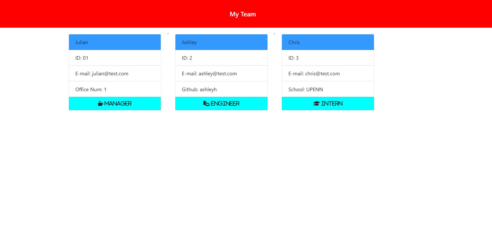

# Dreamteam-Builder

# <dreamteam-builder>

https://github.com/julianr3/dreamteam-builder

## Description

Great application for companies looking to creat an easy profile builder for their team. Answer a few questions ans have a profile generated for you with each employee having their own individual card.

## Table of Contents

- [Installation](#installation)
- [Usage](#usage)
- [Credits](#credits)
- [License](#license)

## Installation
Open index.js in VSCode. Open the terminal associated with index.js and type in "npm install 'inquirer' " then press enter. 
The user will now be able to initiate the series of questions.

## Usage
open the terminal and run "node index.js" and start answering the following series of questions. once complete, select the "index.html" file and open via internet browser. 

## Credits

Kyle Giuanta https://github.com/kgiunta

Isaak Morales https://github.com/CallMeIce

## License
Not Applicable

## Badges

